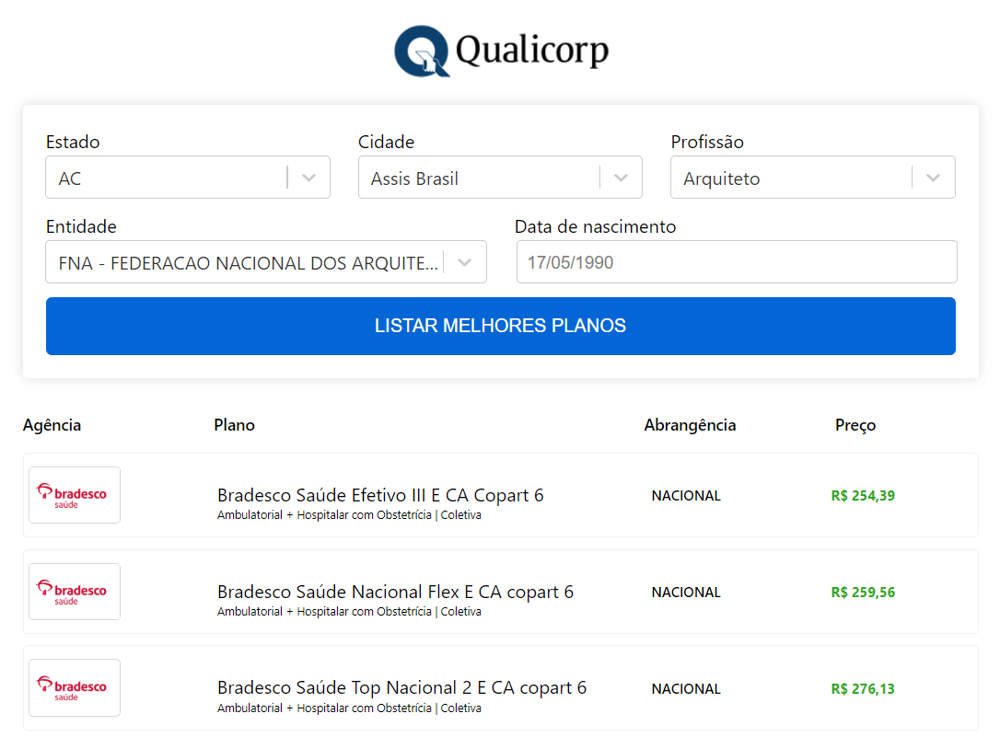

Buscador de planos Qualicorp

## Rodando o projeto

Acesse a pasta do projeto e rode os seguintes comandos para fazer a instalação das dependências:

`yarn` ou `npm install` 

Para iniciar a aplicação rode o comando. 

`yarn start` ou `npm start`

Abra a url [http://localhost:3000](http://localhost:3000) caso ela não abra automaticamente.

## Detalhes da aplicação
Cada input é um Autocomplete que carrega dados diferentes dependendo da seleção anterior, exemplo:
Inicialmente é feita uma consulta na API do IBGE para trazer uma lista de Estados. 
Ao selecionar o Estado, é feita uma nova consulta na API do IBGE para trazer a lista de Cidades com base no Estado selecionado. 
Quando a Cidade é selecionada, é feita uma busca na API da Qualicorp para trazer as profissões daquela Cidade e assim por diante até a seleção da data de nascimento. 
Por fim ao escolher a data de nascimento no Datepicker customizado, o botão para enviar o formulário é habilitado e ao envio deste, é feita uma nova consulta na API Qualicorp usando os dados preenchidos no formulário para listar os planos de saúde em tela.
